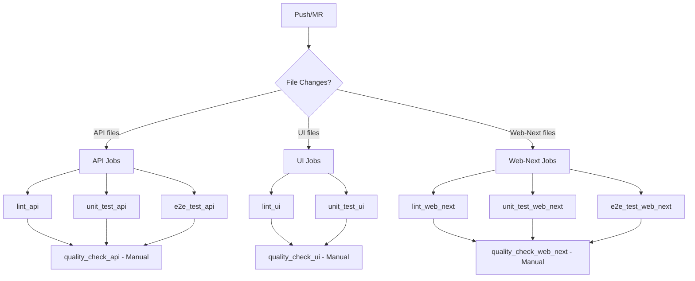

# Complete CI/CD Setup for Barum Monorepo

This document describes the comprehensive linting and testing setup for all packages in the Barum monorepo for GitLab CI/CD.

## 📦 Packages Configured

### ✅ API Package (`packages/api`)

- **Framework**: NestJS with GraphQL
- **Testing**: Jest with unit and E2E tests
- **Coverage**: Cobertura, LCOV, HTML reports
- **Database**: PostgreSQL for testing

### ✅ UI Package (`packages/ui`)

- **Framework**: React component library with Mantine
- **Testing**: Jest with React Testing Library
- **Build**: TSUP for component library bundling
- **Coverage**: Component and utility testing

### ✅ Web-Next Package (`packages/web-next`)

- **Framework**: Next.js application
- **Testing**: Jest + Playwright for E2E
- **Build**: Next.js optimized builds
- **Coverage**: Page and component testing

## 🎯 GitLab CI Jobs Summary

### API Package Jobs

- `lint_api` - ESLint, Prettier, TypeScript checks
- `unit_test_api` - Jest unit tests with coverage
- `e2e_test_api` - End-to-end integration tests
- `quality_check_api` - Comprehensive quality gate (manual)

### UI Package Jobs

- `lint_ui` - ESLint, Prettier, TypeScript checks
- `unit_test_ui` - Component unit tests with coverage
- `quality_check_ui` - Comprehensive quality gate (manual)

### Web-Next Package Jobs

- `lint_web_next` - Next.js linting, Prettier, TypeScript checks
- `unit_test_web_next` - Page and component unit tests
- `e2e_test_web_next` - Playwright E2E tests
- `quality_check_web_next` - Comprehensive quality gate (manual)

## 🚀 Local Development Scripts

Each package now includes standardized scripts:

```bash
# Development
yarn lint              # Auto-fix linting issues
yarn lint:check        # Check linting (CI-friendly)
yarn format            # Format code with Prettier

# Testing
yarn test              # Run unit tests
yarn test:watch        # Run tests in watch mode
yarn test:cov          # Run tests with coverage
yarn test:e2e          # Run E2E tests (where applicable)

# CI
yarn ci:checks         # Comprehensive CI checks
yarn ci:checks:quick   # Quick CI checks
```

## 📊 Coverage Reporting

All packages generate coverage reports in multiple formats:

- **Cobertura XML**: GitLab CI integration
- **LCOV**: Standard coverage format
- **HTML**: Local browser viewing
- **Text**: Terminal output

## 🔧 Pipeline Configuration

### Parallel Execution

Jobs are configured to run in parallel for maximum efficiency:

```
TEST STAGE
├── API Jobs (run when packages/api/** changes)
├── UI Jobs (run when packages/ui/** changes)
└── Web-Next Jobs (run when packages/web-next/** or packages/ui/** changes)
```

### Smart Triggering

- **File-based triggers**: Jobs only run when relevant files change
- **Branch protection**: Different rules for main/develop vs. feature branches
- **Merge request support**: All jobs run on MRs for quality assurance

### Manual Quality Gates

Each package has a manual `quality_check_*` job for pre-deployment validation.

## 📁 File Structure Added

### API Package

```
packages/api/
├── src/common/utils/test-utils.spec.ts
├── src/common/base.model.spec.ts
├── test/setup.ts
├── scripts/ci-checks.sh
└── CI_SETUP.md
```

### UI Package

```
packages/ui/
├── src/utils/test-utils.test.ts
├── test/setup.ts
└── scripts/ci-checks.sh
```

### Web-Next Package

```
packages/web-next/
├── lib/utils.test.ts
├── test/setup.ts
└── scripts/ci-checks.sh
```

## 🔍 Quality Standards

### ESLint Configuration

- **API**: NestJS + TypeScript rules
- **UI**: React + Mantine + TypeScript rules
- **Web-Next**: Next.js + React + TypeScript rules

### Jest Configuration

- **API**: Node.js environment with Prisma mocking
- **UI**: JSDOM environment with React Testing Library
- **Web-Next**: JSDOM environment with Next.js mocking

### Coverage Thresholds

- **Statements**: Tracked and reported
- **Branches**: Tracked and reported
- **Functions**: Tracked and reported
- **Lines**: Used for GitLab coverage percentage

## 🚀 GitLab CI Pipeline Flow



## 🎯 Benefits

### For Developers

- **Fast Feedback**: Parallel execution and smart triggers
- **Local Consistency**: Same tools locally and in CI
- **Comprehensive Coverage**: Multiple testing strategies
- **Quality Gates**: Manual approval for critical deployments

### For CI/CD

- **Resource Efficiency**: Only run jobs for changed packages
- **Comprehensive Reporting**: Multiple coverage formats
- **Flexible Deployment**: Manual quality gates for releases
- **Scalable**: Easy to add new packages with same pattern

## 🔧 Usage Examples

### Running Local Checks

```bash
# Check specific package
cd packages/api && yarn ci:checks

# Quick check all packages
yarn workspace api ci:checks:quick
yarn workspace ui ci:checks:quick
yarn workspace web-next ci:checks:quick
```

### GitLab CI Triggers

- **Automatic**: Push to main/develop, create MR
- **Manual**: Quality check jobs for comprehensive validation
- **File-based**: Only relevant jobs run based on file changes

## 🎉 Status

✅ **API Package**: Complete with unit tests, E2E tests, and quality gates  
✅ **UI Package**: Complete with component testing and build validation  
✅ **Web-Next Package**: Complete with unit tests, E2E tests, and Next.js builds  
✅ **GitLab CI**: All jobs configured and ready for use  
✅ **Documentation**: Comprehensive setup guides for all packages

The complete CI/CD pipeline is now ready for production use!
